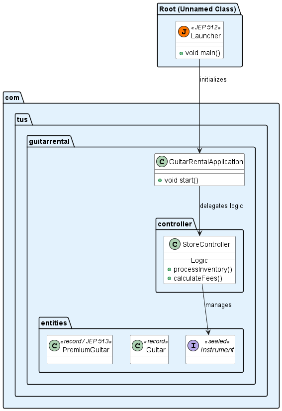
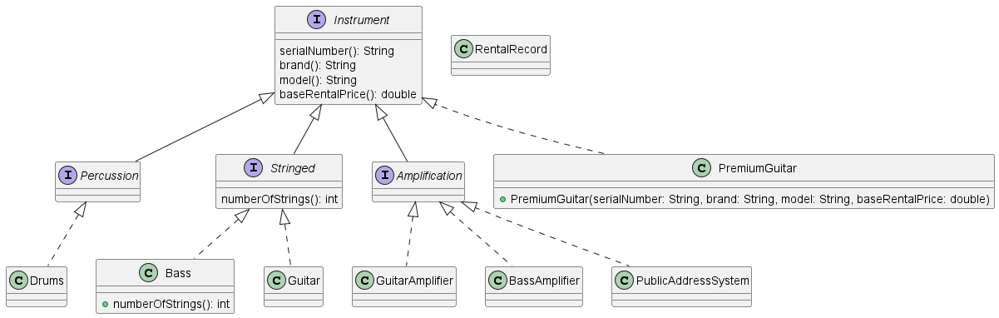
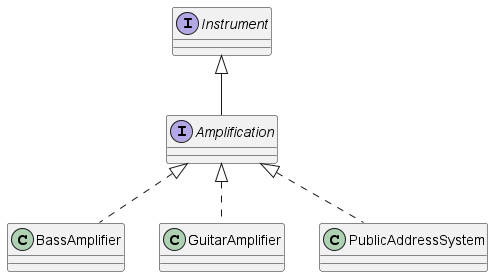
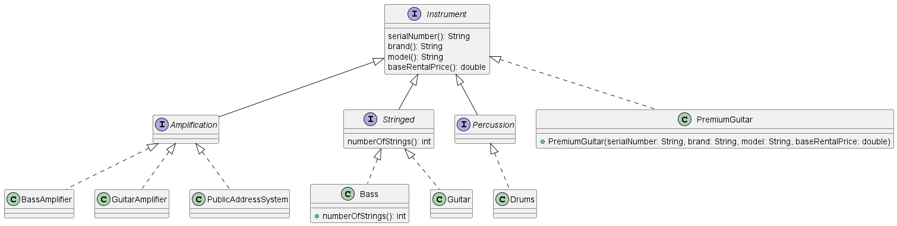
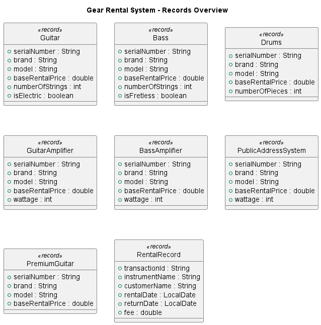

# Object Oriented Programming 2 CA
## Technological University of the Shannon, 2026

![TUS](https://img.shields.io/badge/TUS-2026-black?style=flat-square&logo=data:image/svg+xml;base64,PD94bWwgdmVyc2lvbj0iMS4wIiBlbmNvZGluZz0iVVRGLTgiIHN0YW5kYWxvbmU9Im5vIj8+CjwhLS0gQ3JlYXRlZCB3aXRoIElua3NjYXBlIChodHRwOi8vd3d3Lmlua3NjYXBlLm9yZy8pIC0tPgoKPHN2ZwogICB3aWR0aD0iMTU3LjU1OTM2bW0iCiAgIGhlaWdodD0iMjA1LjE3MTE2bW0iCiAgIHZpZXdCb3g9IjAgMCAxNTcuNTU5MzYgMjA1LjE3MTE2IgogICB2ZXJzaW9uPSIxLjEiCiAgIGlkPSJzdmcxIgogICB4bWw6c3BhY2U9InByZXNlcnZlIgogICB4bWxuczppbmtzY2FwZT0iaHR0cDovL3d3dy5pbmtzY2FwZS5vcmcvbmFtZXNwYWNlcy9pbmtzY2FwZSIKICAgeG1sbnM6c29kaXBvZGk9Imh0dHA6Ly9zb2RpcG9kaS5zb3VyY2Vmb3JnZS5uZXQvRFREL3NvZGlwb2RpLTAuZHRkIgogICB4bWxucz0iaHR0cDovL3d3dy53My5vcmcvMjAwMC9zdmciCiAgIHhtbG5zOnN2Zz0iaHR0cDovL3d3dy53My5vcmcvMjAwMC9zdmciPjxzb2RpcG9kaTpuYW1lZHZpZXcKICAgICBpZD0ibmFtZWR2aWV3MSIKICAgICBwYWdlY29sb3I9IiNmZmZmZmYiCiAgICAgYm9yZGVyY29sb3I9IiMwMDAwMDAiCiAgICAgYm9yZGVyb3BhY2l0eT0iMC4yNSIKICAgICBpbmtzY2FwZTpzaG93cGFnZXNoYWRvdz0iMiIKICAgICBpbmtzY2FwZTpwYWdlb3BhY2l0eT0iMC4wIgogICAgIGlua3NjYXBlOnBhZ2VjaGVja2VyYm9hcmQ9IjAiCiAgICAgaW5rc2NhcGU6ZGVza2NvbG9yPSIjZDFkMWQxIgogICAgIGlua3NjYXBlOmRvY3VtZW50LXVuaXRzPSJtbSI+PGlua3NjYXBlOnBhZ2UKICAgICAgIHg9IjAiCiAgICAgICB5PSIwIgogICAgICAgd2lkdGg9IjE1Ny41NTkzNiIKICAgICAgIGhlaWdodD0iMjA1LjE3MTE2IgogICAgICAgaWQ9InBhZ2UyIgogICAgICAgbWFyZ2luPSIwIgogICAgICAgYmxlZWQ9IjAiIC8+PC9zb2RpcG9kaTpuYW1lZHZpZXc+PGRlZnMKICAgICBpZD0iZGVmczEiPjxzdHlsZQogICAgICAgaWQ9InN0eWxlMSI+LmNscy0xe2ZpbGw6I2EzOTQ2MTt9PC9zdHlsZT48c3R5bGUKICAgICAgIGlkPSJzdHlsZTEtNCI+LmNscy0xe2ZpbGw6I2EzOTQ2MTt9PC9zdHlsZT48L2RlZnM+PGcKICAgICBpbmtzY2FwZTpsYWJlbD0iTGF5ZXIgMSIKICAgICBpbmtzY2FwZTpncm91cG1vZGU9ImxheWVyIgogICAgIGlkPSJsYXllcjEiCiAgICAgdHJhbnNmb3JtPSJ0cmFuc2xhdGUoMjA4LjE2MDkzLDQ4Ljg3NTE2MikiPjxnCiAgICAgICBpZD0iQXJ0d29yayIKICAgICAgIHRyYW5zZm9ybT0ibWF0cml4KDAuMjY0NTgzMzMsMCwwLDAuMjY0NTgzMzMsLTIwOC4xNjA5NCwtNDguODc1MTU4KSI+PHBhdGgKICAgICAgICAgY2xhc3M9ImNscy0xIgogICAgICAgICBkPSJNIDU5NS40OCwwIEggNDc2LjM4IFYgNTguNTIgSCAzNTcuMyBWIDAgSCAyMzguMiBWIDU4LjUyIEggMTE5LjEgViAwIEggMCB2IDM1Ny4yOSBoIDExOS4xIGEgMTc4LjY0LDE3OC42NCAwIDEgMSAzNTcuMjgsMCBoIDExOS4wNiB6IgogICAgICAgICBpZD0icGF0aDEiIC8+PHJlY3QKICAgICAgICAgY2xhc3M9ImNscy0xIgogICAgICAgICB4PSI0NzYuMzgiCiAgICAgICAgIHk9IjcxNS45MDAwMiIKICAgICAgICAgd2lkdGg9IjExOS4xIgogICAgICAgICBoZWlnaHQ9IjU5LjU0OTk5OSIKICAgICAgICAgaWQ9InJlY3QxIiAvPjxyZWN0CiAgICAgICAgIGNsYXNzPSJjbHMtMSIKICAgICAgICAgeT0iNzE1LjkwMDAyIgogICAgICAgICB3aWR0aD0iMTE5LjEiCiAgICAgICAgIGhlaWdodD0iNTkuNTQ5OTk5IgogICAgICAgICBpZD0icmVjdDIiCiAgICAgICAgIHg9IjAiIC8+PHJlY3QKICAgICAgICAgY2xhc3M9ImNscy0xIgogICAgICAgICB5PSI1OTYuNzk5OTkiCiAgICAgICAgIHdpZHRoPSIxMTkuMSIKICAgICAgICAgaGVpZ2h0PSI1OS41NDk5OTkiCiAgICAgICAgIGlkPSJyZWN0MyIKICAgICAgICAgeD0iMCIgLz48cmVjdAogICAgICAgICBjbGFzcz0iY2xzLTEiCiAgICAgICAgIHg9IjQ3Ni4zOTk5OSIKICAgICAgICAgeT0iNTk2Ljc5OTk5IgogICAgICAgICB3aWR0aD0iMTE5LjEiCiAgICAgICAgIGhlaWdodD0iNTkuNTQ5OTk5IgogICAgICAgICBpZD0icmVjdDQiIC8+PHJlY3QKICAgICAgICAgY2xhc3M9ImNscy0xIgogICAgICAgICB4PSIxMTkuMSIKICAgICAgICAgeT0iNTM3LjI1IgogICAgICAgICB3aWR0aD0iMzU3LjI5OTk5IgogICAgICAgICBoZWlnaHQ9IjU5LjU0OTk5OSIKICAgICAgICAgaWQ9InJlY3Q1IiAvPjxwb2x5Z29uCiAgICAgICAgIGNsYXNzPSJjbHMtMSIKICAgICAgICAgcG9pbnRzPSI0NzYuMzksNjU2LjM1IDExOS4xLDY1Ni4zNSAxMTkuMSw3MTUuOSAyMzguMiw3MTUuOSAyMzguMiw3NzUuNDUgMzU3LjI5LDc3NS40NSAzNTcuMjksNzE1LjkgNDc2LjM5LDcxNS45ICIKICAgICAgICAgaWQ9InBvbHlnb241IiAvPjxyZWN0CiAgICAgICAgIGNsYXNzPSJjbHMtMSIKICAgICAgICAgeD0iNDc2LjM5OTk5IgogICAgICAgICB5PSI0MTguMTYiCiAgICAgICAgIHdpZHRoPSIxMTkuMSIKICAgICAgICAgaGVpZ2h0PSIxMTkuMSIKICAgICAgICAgaWQ9InJlY3Q2IiAvPjxyZWN0CiAgICAgICAgIGNsYXNzPSJjbHMtMSIKICAgICAgICAgeT0iNDE4LjE2IgogICAgICAgICB3aWR0aD0iMTE5LjEiCiAgICAgICAgIGhlaWdodD0iMTE5LjEiCiAgICAgICAgIGlkPSJyZWN0NyIKICAgICAgICAgeD0iMCIgLz48L2c+PC9nPjwvc3ZnPgo=)


**Student Name**: Joe O'Regan  
**Student Number**: A00258304  
**Course**: Msc in Software Design with Cloud Native Computing  
**Module**: OOP2

Demonstrate ability to apply the learning from the module to build a Java application demonstrating the following language features:

- Fundamentals:
  - Sorting
  - Lambdas
  - Streams
  - Switch Expressions and Pattern Matching
  - Date/Time API
  - Records
- Advanced:
  - Concurrency
  - NIO2
  - Localisation
  - Compact Source Files + Instant Main Methods
  - Flexible Cosntructor Bodies

---

## Quick Run Command

```bash title="Terminal Command"
java --enable-preview --source 25 src/main/java/Launcher.java
```
---
## Built With

- **JDK**: 25 (with Preview Features enabled)
- **Build Tool**: Maven 3.9+
- **IDE**: Spring Tools Suite 4 (Eclipse-based)

---

## Directory Structure

```text title="Directory Structure" 
├── Launcher.java                 # Entry Point (JEP 512)
├── pom.xml                       # Maven Configuration
├── inventory_report.txt          # Sample Output (NIO.2)
└── src/
    └── main/
        └── java/
            └── com/tus/guitarrental/
                ├── GuitarRentalApplication.java
                ├── Logo.java
                ├── controller/
                │   └── StoreController.java
                └── entities/      # Sealed Interfaces & Records
                    ├── Instrument.java
                    ├── PremiumGuitar.java
                    └── ... (other entities)
```
---

## Guitar Store Management System

The main objective of this application is to demonstrate proficiency in modern Java features, specifically focusing on the transition from fundamental functional programming to the latest enhancements in Java 25.

---

### Diagrams 



    Figure 1. High-Level Architecture Diagram



    Figure 2. Entity Class Diagram



    Figure 3. Amplification Hierarchy



    Figure 4. Records



    Figure 5. Records Overview

---

## Advanced Features

### Concurrency

The application uses the Java Concurrency API (via ExecutorService) to demonstrate high-performance asynchronous processing.

- **Logic**: Instead of processing rental returns sequentially (one by one), the system handles them in parallel using a Fixed Thread Pool.
- **ExecutorService**: Manages a pool of three worker threads, decoupling task submission from execution. This ensures the application remains responsive while "heavy" tasks (simulated item inspections) run in the background.
- **Thread Safety**: Demonstrates proper lifecycle management of threads, including controlled shutdown() and awaitTermination() protocols to ensure all batch tasks complete before the program proceeds.

---

### NIO.2

#### Inventory Report Example

Sample inventory report generated using NIO.2.

```text title="inventory_report.txt"
Serial: GE001 | Brand: Fender   | Model: Stratocaster | Price: €1200.00
Serial: GE002 | Brand: Fender   | Model: Telecaster   | Price: €1100.00
Serial: GE003 | Brand: Fender   | Model: Tom Morello  | Price: €1899.00
Serial: GE004 | Brand: Gibson   | Model: Les Paul     | Price: €2500.00
Serial: GE005 | Brand: Gibson   | Model: SG           | Price: €1800.00
Serial: BE001 | Brand: Washburn | Model: XB400        | Price: €450.00
Serial: BE002 | Brand: Washburn | Model: XB105        | Price: €389.00
Serial: DA001 | Brand: Pearl    | Model: Export       | Price: €900.00
Serial: DE002 | Brand: Alesis   | Model: Debut        | Price: €279.00
Serial: AG001 | Brand: Marshall | Model: JVM410H      | Price: €1500.00
Serial: AG002 | Brand: Peavey   | Model: Bandit       | Price: €299.00
Serial: AB001 | Brand: Peavey   | Model: TKO          | Price: €479.00
Serial: PA001 | Brand: Bose     | Model: L1 Compact   | Price: €999.00
```

---

## Release

<https://github.com/joeaoregan/TUS-26-OOP2-CA/releases/tag/CA-Submission>